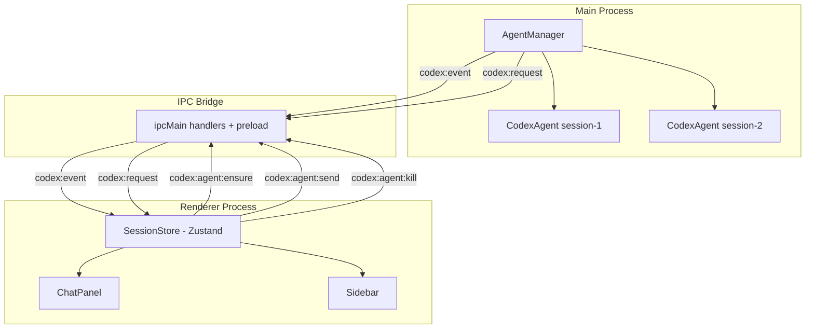

# Design Document: Codex Session Manager

## Overview

This design replaces the current per-tab, ephemeral Codex connection model with a persistent, multi-session architecture. Codex agents are started at app startup (or project open), kept alive across tab switches, and organized into named sessions per project. Conversation history lives in a Zustand store in the renderer process. The sidebar shows live activity indicators for any background session that is streaming.

The existing `AgentManager` / `CodexAgent` / `CodexRpc` / `CodexProcess` stack in the main process is largely preserved — we extend it rather than replace it. The renderer gains a new `useSessionStore` (Zustand) that is the single source of truth for all session and message state.

---

## Architecture



Key design decisions:
- **Main process owns agent lifecycle** — `AgentManager` is the authority on which agents are alive.
- **Renderer owns conversation state** — `SessionStore` holds all messages, streaming flags, and session metadata. This avoids serializing large message arrays over IPC.
- **Session ID is the join key** — every IPC message carries a `sessionId` (formerly `agentId`) that routes events to the correct session in the store.
- **Tab switching is purely a renderer concern** — switching tabs only changes which session is "active" in the store; no IPC calls are made.

---

## Components and Interfaces

### Main Process: `AgentManager` (extended)

No structural changes. The `agentId` parameter already acts as a session ID. The manager already supports multiple concurrent agents. The only change is that `ensure` is called at startup from `main.ts` rather than on demand from the renderer.

### Main Process: `main.ts` (extended)

- On `app.whenReady`, after loading the last project path, call `codexManager.ensure(defaultSessionId, { cwd: lastProjectPath })` to pre-warm the connection.
- Emit a `codex:session:ready` IPC event to the renderer once the agent is ready, carrying the `CodexAgentSession` payload.
- Add a new IPC handler `codex:session:create` that creates a new agent for a given `{ sessionId, cwd }`.

### Renderer: `SessionStore` (new — `src/stores/session-store.ts`)

Central Zustand store. Replaces all local state in `CodexChatPanel` that relates to sessions and messages.

```typescript
type SessionStatus = "connecting" | "connected" | "streaming" | "error" | "idle";

type ChatMessage = {
  id: string;
  role: "user" | "assistant" | "system";
  content: string;
  createdAt: number;
};

type Session = {
  id: string;           // unique session ID, e.g. "proj:/path:1"
  projectPath: string;
  name: string;         // user-visible name, e.g. "Session 1"
  status: SessionStatus;
  errorMessage?: string;
  messages: ChatMessage[];
  threadId: string | null;
  models: CodexModelOption[];
  defaultModel: string | null;
  selectedModel: string | null;
  pendingRequest: CodexRequestPayload | null;
  createdAt: number;
};

type SessionStoreState = {
  sessions: Record<string, Session>;
  activeSessionId: string | null;
  // actions
  createSession: (projectPath: string) => string;
  deleteSession: (sessionId: string) => void;
  renameSession: (sessionId: string, name: string) => void;
  setActiveSession: (sessionId: string) => void;
  setSessionReady: (sessionId: string, data: CodexAgentSession) => void;
  setSessionError: (sessionId: string, message: string) => void;
  appendMessage: (sessionId: string, message: ChatMessage) => void;
  appendDelta: (sessionId: string, messageId: string, delta: string) => void;
  setStreaming: (sessionId: string, streaming: boolean) => void;
  setPendingRequest: (sessionId: string, request: CodexRequestPayload | null) => void;
  getSessionsForProject: (projectPath: string) => Session[];
  hasStreamingSession: (projectPath: string) => boolean;
};
```

Session metadata (id, name, projectPath, createdAt) is persisted to `localStorage` via Zustand's `persist` middleware. Message arrays are **not** persisted (in-memory only) to avoid unbounded storage growth.

### Renderer: `ChatPanel` (refactored — `src/components/codex/codex-chat-panel.tsx`)

- Reads all state from `useSessionStore` instead of local `useState`.
- Receives `sessionId` as its only prop (instead of `folderPath`).
- Renders a session selector dropdown at the top (shows all sessions for the current project).
- Auto-scrolls to bottom on new messages using a `useEffect` + `ref`.
- Renders assistant messages with a lightweight markdown renderer (bold, italic, inline code, fenced code blocks).
- Shows a pulsing cursor `▋` at the end of the last assistant message while `status === "streaming"`.

### Renderer: `Sidebar` (refactored — inside `editor.tsx`)

- Reads `sessions` and `hasStreamingSession` from `useSessionStore`.
- Shows a `Loader2` spinner next to any project that has a streaming session.
- Lists sessions under the active project with name + status label.
- "New Session" button calls `createSession(projectPath)` then `window.codex.ensureAgent(newId, cwd)`.

### Renderer: Event Dispatcher (new — `src/lib/codex-events.ts`)

A singleton that subscribes to `window.codex.onEvent` and `window.codex.onRequest` once at app startup (in `App` component or a top-level effect), and routes events to `useSessionStore` actions. This replaces the per-component subscriptions in the current `CodexChatPanel`.

```typescript
export function initCodexEventDispatcher() {
  window.codex.onEvent((payload) => {
    const store = useSessionStore.getState();
    routeCodexEvent(payload, store);
  });

  window.codex.onRequest((payload) => {
    useSessionStore.getState().setPendingRequest(payload.agentId, payload);
  });
}
```

---

## Data Models

### Session ID convention

```
{projectPath}:{index}
```

Example: `C:\projects\myapp:1`, `C:\projects\myapp:2`

The index is a monotonically increasing integer per project, stored in `localStorage` as `codex:session:counter:{projectPath}`.

### localStorage schema

```
codex:sessions  →  Record<sessionId, SessionMeta>
```

Where `SessionMeta` is:
```typescript
type SessionMeta = {
  id: string;
  name: string;
  projectPath: string;
  createdAt: number;
};
```

Messages are **not** stored in localStorage.

### IPC additions

| Channel | Direction | Payload |
|---|---|---|
| `codex:session:ready` | main → renderer | `{ sessionId, session: CodexAgentSession }` |
| `codex:session:create` | renderer → main | `{ sessionId: string, cwd: string }` |

Existing channels (`codex:agent:ensure`, `codex:agent:send`, `codex:agent:kill`, `codex:event`, `codex:request`) are reused unchanged. The `agentId` field in all payloads maps 1:1 to `sessionId`.

---

## Correctness Properties

A property is a characteristic or behavior that should hold true across all valid executions of a system — essentially, a formal statement about what the system should do. Properties serve as the bridge between human-readable specifications and machine-verifiable correctness guarantees.

Property 1: Session isolation — messages never cross sessions
*For any* two distinct session IDs, appending a message to session A must not change the message array of session B.
**Validates: Requirements 2.1, 5.3**

Property 2: Streaming flag consistency
*For any* session, `status === "streaming"` must be true if and only if the last message in that session's message array has `role === "assistant"` and was added after the most recent `turn/started` event and before the most recent `turn/completed` event.
**Validates: Requirements 3.4, 5.4**

Property 3: hasStreamingSession aggregate correctness
*For any* project path, `hasStreamingSession(projectPath)` must return `true` if and only if at least one session in `getSessionsForProject(projectPath)` has `status === "streaming"`.
**Validates: Requirements 5.5, 6.1**

Property 4: Session creation uniqueness
*For any* sequence of `createSession` calls on the same project path, all generated session IDs must be distinct.
**Validates: Requirements 4.2, 5.1**

Property 5: Delete removes session completely
*For any* session ID that exists in the store, calling `deleteSession` must result in that session ID being absent from `sessions` and from `getSessionsForProject`.
**Validates: Requirements 4.6**

Property 6: Rename is reflected immediately
*For any* session ID and any new name string, calling `renameSession` must result in `sessions[id].name === newName` in the same synchronous tick.
**Validates: Requirements 4.5**

Property 7: Delta append is order-preserving
*For any* sequence of delta strings appended to the same assistant message, the final `content` of that message must equal the concatenation of all deltas in the order they were appended.
**Validates: Requirements 2.4, 7.3**

Property 8: Active session switch does not mutate messages
*For any* call to `setActiveSession`, the `messages` array of every session must remain unchanged.
**Validates: Requirements 2.2, 3.1**

---

## Error Handling

- If `codex app-server` fails to start (ENOENT or non-zero exit), `setSessionError` is called with the error message. The sidebar shows an error badge. The user can retry by clicking a "Reconnect" button in the chat panel, which calls `window.codex.ensureAgent` again.
- If an agent exits unexpectedly mid-turn, the `exit` event from `CodexProcess` rejects all pending RPC promises, which surfaces as an `error` notification. The event dispatcher calls `setSessionError`.
- If `createSession` is called but `ensureAgent` fails, the session is created in the store with `status: "error"` and the error message is shown inline.
- Deleting a session while it is streaming: `killAgent` is called first (which terminates the process), then the session is removed from the store.

---

## Testing Strategy

### Unit tests (Vitest)

- `SessionStore` actions: test each action in isolation against an in-memory store instance.
- `routeCodexEvent`: test that each known event method (`turn/started`, `item/agentMessage/delta`, `turn/completed`, `error`) produces the correct store mutations.
- Session ID generation: test uniqueness across many calls.

### Property-based tests (fast-check, Vitest)

Each property above maps to one property-based test using `fast-check`:

- **Property 1** — generate two random session IDs and random messages; verify isolation after append.
- **Property 2** — generate random event sequences; verify streaming flag matches event history.
- **Property 3** — generate random sets of sessions with random statuses; verify aggregate.
- **Property 4** — generate random sequences of `createSession` calls; verify all IDs are unique.
- **Property 5** — generate a random store state; call `deleteSession`; verify absence.
- **Property 6** — generate random session + name; call `renameSession`; verify synchronous update.
- **Property 7** — generate random arrays of delta strings; verify concatenation order.
- **Property 8** — generate random store state; call `setActiveSession`; verify no message mutation.

Minimum 100 iterations per property test.

Tag format: `// Feature: codex-session-manager, Property N: <property text>`

### Integration / E2E

- Playwright test: open app, verify chat panel shows "Connecting…" spinner on startup, then "Connected" once agent is ready.
- Playwright test: send a message, switch to editor tab, switch back — verify message is still present.
