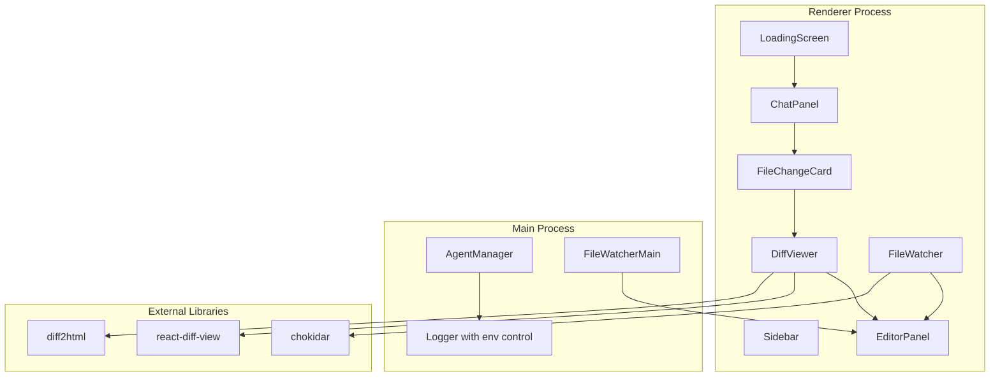

# Design Document: Codex UI Improvements

## Overview

This design enhances the Codex chat interface with production-ready logging, user experience improvements, and a comprehensive diff viewing system. The scope covers:

- Console log suppression with environment-based control
- Turn interruption UI with stop button
- Enhanced message rendering with full MDX support
- Responsive layout fixes for window resizing
- Project removal from recent projects list
- Confirmation dialogs for destructive actions
- Loading screen with initialization progress
- Rich diff viewer with syntax highlighting, accordion layout, and editor integration
- Automatic editor file refresh on external changes
- File watcher integration for real-time updates

---

## Architecture



Key design decisions:
- **Environment-based logging** — Use `NODE_ENV` and `DEBUG` flags to control log verbosity
- **Diff library selection** — Use `react-diff-view` for rich diff rendering with syntax highlighting
- **File watching** — Use `chokidar` for cross-platform file system monitoring
- **Accordion UI** — Use shadcn/ui Accordion component for collapsible file diffs
- **Editor integration** — Use IPC to open files in editor at specific line numbers

---

## Components and Interfaces

### Main Process: Logger Enhancement (`src/main/logger.ts`)

Add environment-based log level control:

```typescript
const LOG_LEVEL = process.env.NODE_ENV === 'production' ? 'warn' : 'debug';
const DEBUG_CODEX = process.env.DEBUG_CODEX === 'true';

export function logCodexRpc(method: string, params: unknown) {
  if (DEBUG_CODEX) {
    console.log(`[Codex RPC] ${method}`, params);
  }
}

export function logCodexEvent(event: string, data: unknown) {
  if (DEBUG_CODEX) {
    console.log(`[Codex Event] ${event}`, data);
  }
}
```

Update all RPC and event logging calls to use these functions.

### Renderer: Stop Button in ChatPanel

Add stop button to the input area when streaming:

```tsx
{status === 'streaming' && currentTurnId && (
  <Button
    variant="destructive"
    size="sm"
    onClick={handleStop}
    className="absolute right-2 top-2"
  >
    <Square className="h-4 w-4 mr-2" />
    Stop
  </Button>
)}
```

Handler:

```typescript
const handleStop = async () => {
  if (!currentTurnId || !session?.threadId) return;
  
  try {
    await window.codex.interruptTurn({
      agentId: sessionId,
      threadId: session.threadId,
      turnId: currentTurnId
    });
    toast.success('Turn interrupted');
  } catch (error) {
    toast.error('Failed to stop turn');
    console.error(error);
  }
};
```

### Renderer: Enhanced Markdown Renderer

Already implemented in `src/components/codex/markdown-renderer.tsx`. Ensure all assistant messages use this component.

### Renderer: Responsive Layout Fixes

Update `codex-chat-panel.tsx` to use flexbox with proper overflow handling:

```tsx
<div className="flex flex-col h-full">
  {/* Header - fixed height */}
  <div className="flex-shrink-0">
    <SessionHeader />
  </div>
  
  {/* Message list - grows to fill space */}
  <div className="flex-1 overflow-y-auto min-h-0">
    <MessageList />
  </div>
  
  {/* Input area - fixed height */}
  <div className="flex-shrink-0">
    <InputBar />
  </div>
</div>
```

Key CSS properties:
- `min-h-0` on flex children to allow shrinking below content size
- `overflow-y-auto` on scrollable container
- `flex-shrink-0` on fixed-height sections

### Renderer: Project Removal from Recents

Add context menu to project entries in sidebar:

```tsx
<ContextMenu>
  <ContextMenuTrigger>
    <div className="project-entry">
      {project.name}
    </div>
  </ContextMenuTrigger>
  <ContextMenuContent>
    <ContextMenuItem onClick={() => handleRemoveProject(project.path)}>
      <Trash2 className="h-4 w-4 mr-2" />
      Remove from Recents
    </ContextMenuItem>
  </ContextMenuContent>
</ContextMenu>
```

Handler:

```typescript
const handleRemoveProject = (projectPath: string) => {
  // Remove from recent projects store
  removeRecentProject(projectPath);
  
  // Persist to localStorage
  localStorage.setItem('recentProjects', JSON.stringify(recentProjects));
  
  toast.success('Project removed from recents');
};
```

### Renderer: Session Deletion Confirmation

Add confirmation dialog using shadcn/ui AlertDialog:

```tsx
<AlertDialog open={deleteDialogOpen} onOpenChange={setDeleteDialogOpen}>
  <AlertDialogContent>
    <AlertDialogHeader>
      <AlertDialogTitle>Delete Session?</AlertDialogTitle>
      <AlertDialogDescription>
        This will permanently delete "{sessionToDelete?.name}" and all its conversation history.
        This action cannot be undone.
      </AlertDialogDescription>
    </AlertDialogHeader>
    <AlertDialogFooter>
      <AlertDialogCancel>Cancel</AlertDialogCancel>
      <AlertDialogAction onClick={confirmDelete} className="bg-destructive">
        Delete
      </AlertDialogAction>
    </AlertDialogFooter>
  </AlertDialogContent>
</AlertDialog>
```

### Renderer: Loading Screen (`src/components/loading-screen.tsx`)

Full-screen overlay with initialization progress:

```tsx
export function LoadingScreen({ status, error }: LoadingScreenProps) {
  return (
    <div className="fixed inset-0 bg-background z-50 flex items-center justify-center">
      <div className="flex flex-col items-center gap-4">
        
        
        {error ? (
          <>
            <AlertCircle className="h-8 w-8 text-destructive" />
            <p className="text-destructive">{error}</p>
            <Button onClick={onRetry}>Retry</Button>
          </>
        ) : (
          <>
            <Loader2 className="h-8 w-8 animate-spin" />
            <p className="text-muted-foreground">{status}</p>
          </>
        )}
      </div>
    </div>
  );
}
```

Integration in `app.tsx`:

```tsx
const [appReady, setAppReady] = useState(false);
const [loadingStatus, setLoadingStatus] = useState('Initializing...');

useEffect(() => {
  const init = async () => {
    setLoadingStatus('Starting Codex...');
    await window.codex.ensureAgent(defaultSessionId, { cwd: lastProjectPath });
    
    setLoadingStatus('Loading workspace...');
    await loadWorkspace();
    
    setLoadingStatus('Ready');
    setTimeout(() => setAppReady(true), 500); // Fade out
  };
  
  init();
}, []);

if (!appReady) {
  return <LoadingScreen status={loadingStatus} />;
}
```

### Renderer: Diff Viewer Component (`src/components/codex/diff-viewer.tsx`)

Comprehensive diff viewer using `react-diff-view`:

```tsx
import { Diff, Hunk, parseDiff } from 'react-diff-view';
import { Accordion, AccordionContent, AccordionItem, AccordionTrigger } from '@/components/ui/accordion';
import { Button } from '@/components/ui/button';
import { Tabs, TabsList, TabsTrigger } from '@/components/ui/tabs';
import 'react-diff-view/style/index.css';

interface DiffViewerProps {
  changes: Array<{
    path: string;
    kind: string;
    diff?: string;
    oldContent?: string;
    newContent?: string;
  }>;
  onOpenFile: (path: string, line?: number) => void;
}

export function DiffViewer({ changes, onOpenFile }: DiffViewerProps) {
  const [viewType, setViewType] = useState<'split' | 'unified'>('unified');
  
  return (
    <div className="border rounded-lg p-4 space-y-4">
      <div className="flex items-center justify-between">
        <h3 className="font-semibold">File Changes ({changes.length})</h3>
        <Tabs value={viewType} onValueChange={(v) => setViewType(v as any)}>
          <TabsList>
            <TabsTrigger value="unified">Unified</TabsTrigger>
            <TabsTrigger value="split">Split</TabsTrigger>
          </TabsList>
        </Tabs>
      </div>
      
      <Accordion type="multiple" className="w-full">
        {changes.map((change, idx) => {
          const files = parseDiff(change.diff || '');
          const file = files[0];
          
          return (
            <AccordionItem key={idx} value={`file-${idx}`}>
              <AccordionTrigger className="hover:no-underline">
                <div className="flex items-center gap-2 flex-1">
                  <FileChangeIcon kind={change.kind} />
                  <span className="font-mono text-sm">{change.path}</span>
                  <Badge variant={getChangeBadgeVariant(change.kind)}>
                    {change.kind}
                  </Badge>
                </div>
              </AccordionTrigger>
              
              <AccordionContent>
                <div className="space-y-2">
                  <Button
                    variant="outline"
                    size="sm"
                    onClick={() => onOpenFile(change.path, getFirstChangedLine(file))}
                  >
                    <ExternalLink className="h-4 w-4 mr-2" />
                    Open in Editor
                  </Button>
                  
                  <div className="border rounded overflow-x-auto">
                    <Diff
                      viewType={viewType}
                      diffType={file.type}
                      hunks={file.hunks}
                    >
                      {(hunks) => hunks.map((hunk) => (
                        <Hunk key={hunk.content} hunk={hunk} />
                      ))}
                    </Diff>
                  </div>
                </div>
              </AccordionContent>
            </AccordionItem>
          );
        })}
      </Accordion>
    </div>
  );
}
```

Helper functions:

```typescript
function getFirstChangedLine(file: File): number {
  if (!file.hunks.length) return 1;
  return file.hunks[0].newStart;
}

function getChangeBadgeVariant(kind: string): string {
  switch (kind) {
    case 'create': return 'success';
    case 'delete': return 'destructive';
    case 'modify': return 'warning';
    default: return 'default';
  }
}

function FileChangeIcon({ kind }: { kind: string }) {
  switch (kind) {
    case 'create': return <FilePlus className="h-4 w-4 text-green-500" />;
    case 'delete': return <FileX className="h-4 w-4 text-red-500" />;
    case 'modify': return <FileEdit className="h-4 w-4 text-yellow-500" />;
    default: return <File className="h-4 w-4" />;
  }
}
```

### Renderer: File Change Card Integration

Update `file-change-card.tsx` to include diff viewer:

```tsx
export function FileChangeCard({ item }: { item: FileChangeItem }) {
  const [showDiff, setShowDiff] = useState(false);
  
  const handleOpenFile = async (path: string, line?: number) => {
    await window.editor.openFile({ path, line });
  };
  
  return (
    <Card>
      <CardHeader>
        <div className="flex items-center justify-between">
          <CardTitle className="text-sm">File Changes</CardTitle>
          <Button
            variant="ghost"
            size="sm"
            onClick={() => setShowDiff(!showDiff)}
          >
            {showDiff ? 'Hide' : 'View'} Diff
          </Button>
        </div>
      </CardHeader>
      
      <CardContent>
        {!showDiff ? (
          <div className="space-y-1">
            {item.changes.map((change, idx) => (
              <div key={idx} className="flex items-center gap-2 text-sm">
                <FileChangeIcon kind={change.kind} />
                <span className="font-mono">{change.path}</span>
              </div>
            ))}
          </div>
        ) : (
          <DiffViewer changes={item.changes} onOpenFile={handleOpenFile} />
        )}
      </CardContent>
    </Card>
  );
}
```

### Main Process: File Watcher (`src/main/file-watcher.ts`)

Use chokidar to watch for file changes:

```typescript
import chokidar from 'chokidar';
import { BrowserWindow } from 'electron';

export class FileWatcher {
  private watchers = new Map<string, chokidar.FSWatcher>();
  
  watchProject(projectPath: string, window: BrowserWindow) {
    if (this.watchers.has(projectPath)) {
      return;
    }
    
    const watcher = chokidar.watch(projectPath, {
      ignored: /(^|[\/\\])\../, // ignore dotfiles
      persistent: true,
      ignoreInitial: true
    });
    
    watcher.on('change', (path) => {
      window.webContents.send('file:changed', { path });
    });
    
    this.watchers.set(projectPath, watcher);
  }
  
  unwatchProject(projectPath: string) {
    const watcher = this.watchers.get(projectPath);
    if (watcher) {
      watcher.close();
      this.watchers.delete(projectPath);
    }
  }
}
```

### Renderer: Editor File Refresh

Update editor to handle file change events:

```tsx
useEffect(() => {
  const unsubscribe = window.electron.on('file:changed', ({ path }) => {
    if (path === currentFilePath) {
      // Check if user has unsaved changes
      if (editor.getModel()?.isModified()) {
        showConflictDialog(path);
      } else {
        reloadFile(path);
      }
    }
  });
  
  return unsubscribe;
}, [currentFilePath]);

async function reloadFile(path: string) {
  const content = await window.fs.readFile(path);
  const position = editor.getPosition();
  const scrollTop = editor.getScrollTop();
  
  editor.setValue(content);
  
  // Restore position if line still exists
  if (position && position.lineNumber <= editor.getModel()?.getLineCount()) {
    editor.setPosition(position);
    editor.setScrollTop(scrollTop);
  }
}
```

### IPC: Open File in Editor

Add IPC handler to open files at specific lines:

```typescript
// Main process
ipcMain.handle('editor:openFile', async (event, { path, line }) => {
  const window = BrowserWindow.fromWebContents(event.sender);
  window?.webContents.send('editor:openFile', { path, line });
});

// Preload
contextBridge.exposeInMainWorld('editor', {
  openFile: (args: { path: string; line?: number }) => 
    ipcRenderer.invoke('editor:openFile', args)
});
```

---

## Data Models

### Diff Data Structure

```typescript
interface FileDiff {
  path: string;
  kind: 'create' | 'modify' | 'delete';
  diff: string;  // Unified diff format
  oldContent?: string;
  newContent?: string;
  hunks: DiffHunk[];
}

interface DiffHunk {
  oldStart: number;
  oldLines: number;
  newStart: number;
  newLines: number;
  changes: DiffChange[];
}

interface DiffChange {
  type: 'insert' | 'delete' | 'normal';
  content: string;
  lineNumber: number;
}
```

### Loading State

```typescript
interface LoadingState {
  isLoading: boolean;
  status: string;
  error?: string;
}
```

---

## Correctness Properties

A property is a characteristic or behavior that should hold true across all valid executions of a system — essentially, a formal statement about what the system should do. Properties serve as the bridge between human-readable specifications and machine-verifiable correctness guarantees.

Property 1: Log suppression in production
*For any* RPC call or event in production mode with `DEBUG_CODEX !== 'true'`, no console log output should be generated.
**Validates: Requirements 1.1, 1.2, 1.3**

Property 2: Stop button visibility
*For any* session state, the stop button is visible if and only if `status === "streaming"` and `currentTurnId !== null`.
**Validates: Requirements 2.1**

Property 3: Layout responsiveness
*For any* window resize event during streaming, the chat panel height must equal the container height and all messages must remain visible via scrolling.
**Validates: Requirements 4.1, 4.2**

Property 4: Project removal persistence
*For any* project removed from recents, calling `getRecentProjects()` after app restart must not include that project.
**Validates: Requirements 5.3**

Property 5: Deletion confirmation requirement
*For any* session deletion attempt, the session must not be deleted unless the user explicitly confirms in the dialog.
**Validates: Requirements 6.1, 6.3, 6.4**

Property 6: Loading screen visibility
*For any* app initialization sequence, the loading screen must be visible until `appReady === true`.
**Validates: Requirements 7.1, 7.4**

Property 7: Diff viewer file count
*For any* file change item with N files, the diff viewer must display exactly N accordion items.
**Validates: Requirements 8.2**

Property 8: Editor navigation correctness
*For any* file path clicked in the diff viewer, the editor must open that exact file.
**Validates: Requirements 8.6**

Property 9: File refresh on external change
*For any* file modified externally while open in the editor (with no local changes), the editor content must update to match the file on disk.
**Validates: Requirements 9.1**

Property 10: Cursor preservation on reload
*For any* file reload where the cursor line number is less than or equal to the new line count, the cursor position must be preserved.
**Validates: Requirements 9.2**

---

## Error Handling

- **Stop button failure**: Display toast notification with error message; keep button enabled for retry
- **File watcher failure**: Log error but don't crash; editor continues to work without auto-refresh
- **Diff parsing failure**: Display raw diff text as fallback; show error badge on accordion item
- **Editor open failure**: Display toast notification; keep "Open in Editor" button enabled
- **Loading timeout**: After 30 seconds, show error state with retry button
- **Project removal failure**: Display error toast; keep project in list
- **File conflict on reload**: Show dialog with options: "Keep Local Changes", "Reload from Disk", "Show Diff"

---

## Testing Strategy

### Unit tests (Vitest)

- Logger: test log suppression based on environment variables
- DiffViewer: test parsing of various diff formats
- FileChangeCard: test diff viewer toggle
- LoadingScreen: test status updates and error states

### Property-based tests (fast-check, Vitest)

Properties 1–10 each map to one `fc.assert(fc.property(...))` test, minimum 100 iterations.

Tag format: `// Feature: codex-ui-improvements, Property N: <property text>`

### Integration / E2E (Playwright)

- Start app → loading screen appears → fades out when ready
- Send message → click stop button → turn interrupts
- Resize window during streaming → layout adapts smoothly
- Right-click project → remove from recents → project disappears
- Click delete session → confirm dialog appears → cancel → session remains
- File change arrives → click "View Diff" → diff viewer expands with syntax highlighting
- Click file path in diff → editor opens to that file
- Modify file externally → editor auto-refreshes content
