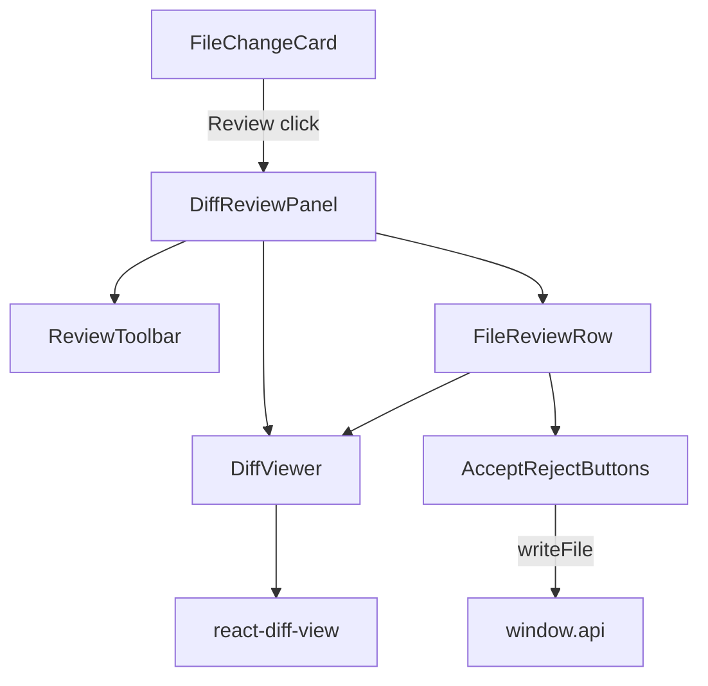

# Design Document: Diff Review Panel

## Overview

The diff review panel gives users a clear, actionable way to review AI-proposed file changes. It replaces the existing inline "View Diff" toggle with a dedicated panel that opens from a "Review" button on every `FileChangeCard`. The panel renders coloured diffs (green for additions, red for deletions), supports per-file and bulk accept/reject, and writes or reverts files on disk via the existing `window.api.writeFile` IPC bridge. An undo mechanism keeps original and new content in memory for the lifetime of the panel.

---

## Architecture



The existing `DiffViewer` component is kept and enhanced. A new `DiffReviewPanel` wraps it with the accept/reject state machine and filesystem calls. `FileChangeCard` gains a "Review" button that opens the panel.

---

## Components and Interfaces

### `DiffReviewPanel`

A full-width panel (rendered inside the chat column, below the card that triggered it) that owns all review state.

```typescript
interface DiffReviewPanelProps {
  changes: FileChangeItem["changes"];
  onOpenFile: (path: string, line?: number) => void;
  onClose: () => void;
}
```

Internal state:
```typescript
type FileDecision = "accepted" | "rejected" | "pending";

interface FileReviewState {
  decision: FileDecision;
  originalContent: string;   // reconstructed from diff
  newContent: string;        // reconstructed from diff
  error?: string;
}

// Map from file path → FileReviewState
type ReviewState = Record<string, FileReviewState>;
```

### `FileReviewRow`

One row per changed file inside the panel. Renders the file header, kind badge, line stats, action buttons, and the expandable diff.

```typescript
interface FileReviewRowProps {
  change: FileChangeItem["changes"][number];
  state: FileReviewState;
  viewType: "unified" | "split";
  onOpenFile: (path: string, line?: number) => void;
  onAccept: (path: string) => void;
  onReject: (path: string) => void;
  onUndo: (path: string) => void;
}
```

### `ReviewToolbar`

Top bar of the panel. Shows file count, view-type tabs, and bulk Accept All / Reject All buttons.

```typescript
interface ReviewToolbarProps {
  fileCount: number;
  viewType: "unified" | "split";
  onViewTypeChange: (v: "unified" | "split") => void;
  onAcceptAll: () => void;
  onRejectAll: () => void;
  onClose: () => void;
}
```

### Updated `FileChangeCard`

Gains a `showReview` boolean state. When `true`, renders `DiffReviewPanel` below the file list. The "Review" / "Close Review" button toggles this state.

---

## Data Models

### Content Reconstruction

The `extractDiffContent` helper (already in `diff-viewer.tsx`) reconstructs `originalContent` and `newContent` from the parsed hunks. This is called once per file when the panel opens and the results are stored in `ReviewState`.

```typescript
function extractDiffContent(file: FileData): { original: string; modified: string }
```

### Line Stats

Computed from the parsed hunks:

```typescript
function computeLineStats(file: FileData): { added: number; removed: number } {
  let added = 0, removed = 0;
  for (const hunk of file.hunks) {
    for (const change of hunk.changes) {
      if (change.type === "insert") added++;
      if (change.type === "delete") removed++;
    }
  }
  return { added, removed };
}
```

---

## Correctness Properties

*A property is a characteristic or behavior that should hold true across all valid executions of a system — essentially, a formal statement about what the system should do. Properties serve as the bridge between human-readable specifications and machine-verifiable correctness guarantees.*

### Property 1: Panel renders all file metadata

*For any* array of N file changes passed to `DiffReviewPanel`, the rendered output must contain exactly N file rows, each showing the file's path and kind badge.

**Validates: Requirements 2.1, 2.2**

---

### Property 2: Diff lines have correct CSS classes

*For any* unified diff string that contains insert and/or delete lines, after parsing and rendering via `DiffViewer`, every insert line must have the `diff-line-insert` class and every delete line must have the `diff-line-delete` class.

**Validates: Requirements 3.1, 3.2**

---

### Property 3: Accept/Reject disables the corresponding button

*For any* file change, after the user clicks "Accept", the Accept button for that file must be disabled; after the user clicks "Reject", the Reject button for that file must be disabled.

**Validates: Requirements 4.4, 4.5**

---

### Property 4: Bulk action marks all eligible files

*For any* array of 2+ file changes, clicking "Accept All" must result in every file being in the "accepted" state; clicking "Reject All" must result in every file being in the "rejected" state.

**Validates: Requirements 5.1, 5.2, 5.3**

---

### Property 5: Content reconstruction round-trip

*For any* valid unified diff string, reconstructing `originalContent` and `newContent` from the parsed hunks and then re-diffing them must produce a diff that, when applied to `originalContent`, yields `newContent`.

**Validates: Requirements 6.4**

---

### Property 6: Accept All / Reject All buttons appear for 2+ files

*For any* array of 2 or more file changes, the `ReviewToolbar` must render both "Accept All" and "Reject All" buttons; for a single file, neither bulk button should appear.

**Validates: Requirements 5.1**

---

## Error Handling

- If `window.api.writeFile` rejects, the `FileReviewRow` for that file displays an inline error badge ("Write failed — try again") and the decision state is reset to `"pending"` so the user can retry.
- If a diff string is missing or unparseable, the file row shows "No diff available" and the Accept/Reject buttons are still shown (they will write/revert using empty string as a fallback, which is safe for new-file creation and deletion).

---

## Testing Strategy

### Dual Testing Approach

Both unit tests and property-based tests are used. Unit tests cover specific interactions and edge cases; property tests verify universal correctness across generated inputs.

### Property-Based Testing Library

**fast-check** (already a dev dependency in this project, used in `diff-viewer.test.tsx`).

Each property test runs a minimum of **100 iterations**.

Tag format: `Feature: diff-review-panel, Property N: <property text>`

### Unit Tests (`src/tests/unit/diff-review-panel.test.tsx`)

- "Review" button is visible on `FileChangeCard`
- Clicking "Review" opens the panel; button label changes to "Close Review"
- Clicking "Close Review" closes the panel
- "Open in Editor" callback is called with the correct path
- Clicking Accept calls `window.api.writeFile` with new content
- Clicking Reject calls `window.api.writeFile` with original content
- After Accept, clicking Undo calls `window.api.writeFile` with original content
- `writeFile` error shows inline error message
- Line numbers are present in the rendered diff gutter

### Property Tests (`src/tests/unit/diff-review-panel.test.tsx`)

- **Property 1** — panel renders all file metadata (fast-check, 100 runs)
- **Property 2** — diff lines have correct CSS classes (fast-check, 100 runs)
- **Property 3** — accept/reject disables the corresponding button (fast-check, 100 runs)
- **Property 4** — bulk action marks all eligible files (fast-check, 100 runs)
- **Property 5** — content reconstruction round-trip (fast-check, 100 runs)
- **Property 6** — bulk buttons appear for 2+ files only (fast-check, 100 runs)
