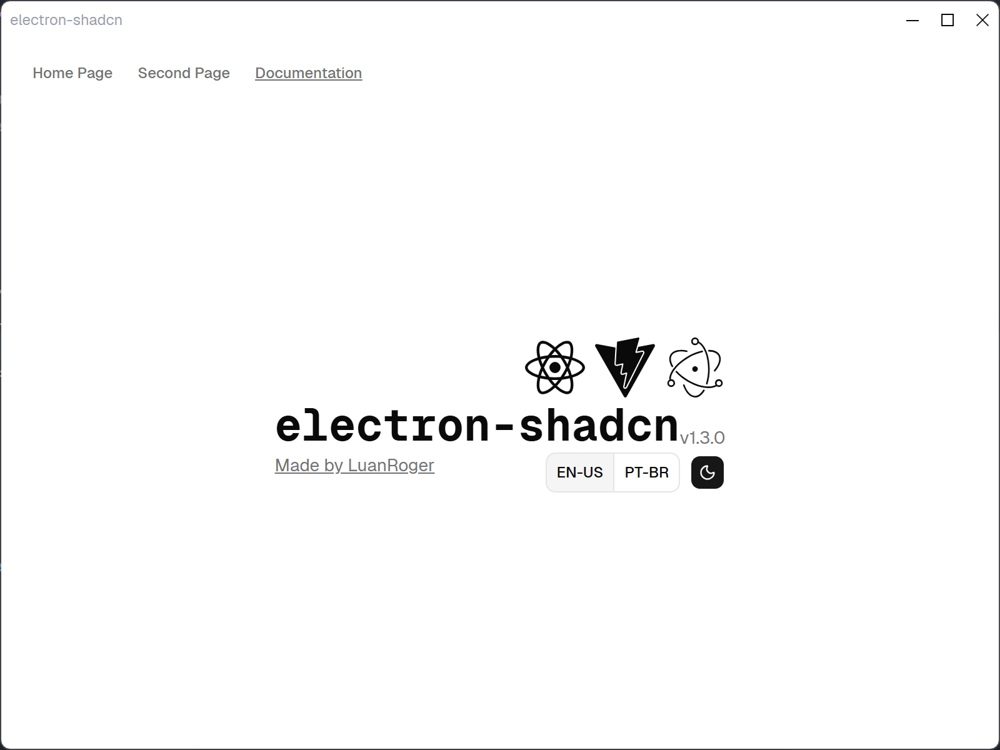

# Anycode

A desktop AI coding assistant built on Electron. Anycode pairs a full Monaco code editor with an AI chat panel powered by OpenAI Codex, letting you browse, edit, and talk about your projects without leaving the app.



## What it does

- **AI chat panel** — ask Codex to inspect, explain, or modify code in your current project. Supports multi-turn conversations with streaming responses.
- **Monaco editor** — full VS Code-grade editor with syntax highlighting, TypeScript/JavaScript IntelliSense, and multi-tab support.
- **Project management** — open any local folder as a project, switch between recent projects, and manage files and folders from a built-in tree view.
- **Session management** — run multiple named Codex sessions per project, rename them, switch between them, and reconnect after errors.
- **Thread controls** — fork, rollback, compact context, or archive conversation threads mid-session.
- **MCP server support** — connect Model Context Protocol servers and inspect their status from within the chat panel.
- **Skills** — invoke reusable agent skills inline using `$skill-name` syntax in the chat input.
- **Rate limit & auth indicators** — live usage indicators and authentication status badges in the chat header.
- **Quick open** — `Ctrl/Cmd+P` fuzzy file search across the open project.
- **i18n** — internationalization support via i18next.
- **Auto update** — checks for new releases on startup via GitHub Releases.

## Tech stack

| Layer | Libraries |
|---|---|
| Shell | Electron 41, Electron Forge |
| Renderer | React 19, Vite 8, TypeScript 5.9 |
| Routing | TanStack Router (file-based) |
| State | Zustand (with persistence) |
| Data fetching | TanStack Query |
| Editor | Monaco Editor |
| UI | shadcn/ui, Tailwind 4, Radix UI, Lucide |
| IPC / RPC | oRPC, Zod 4 |
| Fonts | Geist, Geist Mono |
| i18n | i18next, react-i18next |
| Animation | Motion |
| Linting | Biome via Ultracite |
| Unit tests | Vitest, React Testing Library |
| E2E tests | Playwright |

## Getting started

```bash
# 1. Clone
git clone <repo-url>

# 2. Install dependencies (also generates Codex types via postinstall)
npm install

# 3. Start the app
npm run start
```

## Scripts

| Command | Description |
|---|---|
| `npm run start` | Start in development mode |
| `npm run make` | Package and create distributables |
| `npm run publish` | Publish a new release to GitHub |
| `npm run check` | Lint and type-check |
| `npm run fix` | Auto-fix lint issues |
| `npm test` | Run unit tests |
| `npm run test:e2e` | Run Playwright e2e tests |
| `npm run test:all` | Run all tests |

## Project structure

```
src/
  app.tsx              # Root component, session reconnect on startup
  main.ts              # Electron main process
  preload.ts           # Context bridge (window.api, window.codex)
  routes/
    editor.tsx         # Main editor + chat view
  components/
    codex/             # Chat panel, session UI, MCP panel, skills picker
    ui/                # shadcn/ui primitives + animated AI input
  stores/
    session-store.ts   # Zustand store for Codex sessions
    editor-ui.ts       # Editor tabs and view state
  lib/
    codex-events.ts    # IPC event dispatcher for Codex streaming
  types/               # Shared TypeScript types
  localization/        # i18n resources
```

## Auto update

The app checks for updates on launch using [update-electron-app](https://github.com/electron/update-electron-app) against GitHub Releases. To publish a release, set `GITHUB_TOKEN` and run `npm run publish`, or trigger the included GitHub Actions workflow by pushing a new tag.

> Auto update only works for public GitHub repositories. For private repos, configure a custom update server — see the [Electron update docs](https://www.electronjs.org/docs/latest/tutorial/updates).

## License

MIT — see [LICENSE](LICENSE).
